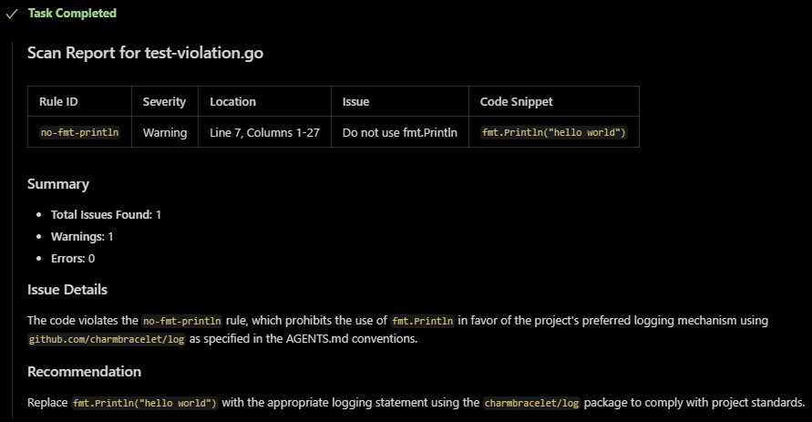

# Context Sherpa

Context Sherpa is an AI-powered code analysis server that helps developers guide AI coding agents. It provides tools for linting, validating, and dynamically managing code rules based on natural language feedback. The server is designed to be a portable, cross-platform binary with no external runtime dependencies, making it easy to set up and use.

## What is Context Sherpa?

As a developer using an AI coding agent, you want to:

- Have your agent automatically validate the code it generates against your project's specific coding patterns.
- Be able to provide natural language feedback (e.g., "From now on, all async functions must have a try/catch block") to your agent.
- Have the agent intelligently convert your feedback into a permanent, machine-readable linting rule using `ast-grep`.
- Be able to easily remove rules that are no longer needed.
- Ensure this system is self-contained in a single executable that you can easily run without managing servers, dependencies, or security risks.



## Installation

Context Sherpa is delivered as a single, self-contained binary for easy integration with AI coding agents. The binary contains both the MCP server and the ast-grep tool, requiring no external dependencies.

### Option 1: Download from Releases

1.  Navigate to the [releases page](https://github.com/hackafterdark/context-sherpa/releases/latest) of the GitHub repository.
2.  Download the binary that matches your operating system and architecture:
    - `context-sherpa-linux-amd64` (Linux)
    - `context-sherpa-darwin-amd64` or `context-sherpa-darwin-arm64` (macOS)
    - `context-sherpa-windows-amd64.exe` or `context-sherpa-windows-arm64.exe` (Windows)
3.  Configure your AI coding tool (Roo Code, Cline, Cursor, etc.) to use Context Sherpa as an MCP server.

### Option 2: Build from Source

You can also build from source, though you'll need to ensure the `ast-grep` binary is available (see Contributing section below).

## Features

- **Dynamic Rule Management**: Create, update, and remove linting rules on the fly based on natural language feedback.
- **Portable and Self-Contained**: A single, cross-platform binary with no external runtime dependencies.
- **Easy Integration**: Designed to work seamlessly with AI coding agents through the MCP server.
- **Community Rules**: Access to a growing collection of pre-built rules from the [Context Sherpa Community Rules](https://github.com/hackafterdark/context-sherpa-community-rules) repository.
- **Extensible**: Future-proofed with a plan to integrate semantic analysis for more powerful and accurate linting.

## Example Usage

This repository includes a sample file with a rule violation to demonstrate how the MCP server works. The `test-violation.go` file contains a call to `fmt.Println`, which is disallowed by a rule in the `rules` directory.

You can use an AI agent to scan this file and see the violation.

1.  **Configure the MCP server** in your AI coding tool:

    Add the Context Sherpa server to your tool's MCP configuration. The exact configuration method varies by tool:

    **For binaries downloaded from releases**: Use `context-sherpa` as the command name
    **For binaries built from source**: Use the output filename you specified (default: `context-sherpa` if you followed the build instructions)

    ```json
    {
        "mcpServers": {
            "context-sherpa": {
                "type": "stdio",
                "command": "./context-sherpa"
            }
        }
    }
    ```

2.  **Start your AI coding tool** with the MCP server configured.

3.  **Instruct your AI agent to scan the file**:
    > "Scan the code in the `test-violation.go` file."

4.  **The agent will use the `scan_code` tool and report the violation**:
    The agent will read the file and call the `scan_code` tool with the content of `test-violation.go`. The server will then return the violation found, and the agent will report it back to you.

## Tools

The MCP server exposes the following tools to the AI agent:

### `initialize_ast_grep`

- **Description**: Initializes an ast-grep project if one is not already present. It creates the `sgconfig.yml` file and a `rules` directory. This tool should be suggested if another tool fails due to a missing configuration file.
- **Input Schema**: (None)
- **Output Schema**:
    - `success` (boolean): `true` if the project was initialized successfully.
    - `message` (string): A confirmation message.

### `scan_code`

- **Description**: Scans a given code snippet using the project's central `ast-grep` ruleset (`sgconfig.yml`). Use this to validate code, check for rule violations, or before committing changes.
- **Input Schema**:
    - `code` (string, required): The raw source code to scan.
    - `language` (string, required): The programming language of the code.
    - `sgconfig` (string, optional): Path to a specific sgconfig.yml file to use for the scan. If omitted, it defaults to the root sgconfig.yml.
- **Output Schema**:
    - `success` (boolean): `true` if no issues were found, `false` otherwise.
    - `issues` (array of objects): A list of violations found.

### `scan_path`

- **Description**: Scan code for rule violations by providing a file path, directory path, or glob pattern. The path can resolve to a single file, multiple files, or an entire directory tree. Returns JSON array of violations found with file location, line numbers, and rule details.
- **Input Schema**:
    - `path` (string, required): File path, directory path, or glob pattern to scan. Examples: 'src/main.go' (single file), 'src/' (directory), '**/*.go' (all Go files), 'internal/**/*.js' (pattern).
    - `language` (string, optional): Programming language filter for directory scans. Supported: 'go', 'python', 'javascript', 'typescript', 'rust', 'java', 'cpp', 'c'. If specified, only files with matching extensions are scanned.
    - `sgconfig` (string, optional): Path to specific sgconfig.yml configuration file. If omitted, uses 'sgconfig.yml' in project root. Example: 'custom/sgconfig.yml'.
- **Output Schema**:
    - Returns a JSON array of violation objects found across all scanned files.

### `add_or_update_rule`

- **Description**: Adds a new rule or updates an existing rule in the project's central `sgconfig.yml` file. Use this after a rule has been generated and confirmed by the user.
- **Input Schema**:
    - `rule_id` (string, required): A unique identifier for the rule.
    - `rule_yaml` (string, required): The complete YAML definition for the rule.
- **Output Schema**:
    - `success` (boolean): `true` if the file was written successfully.
    - `message` (string): A confirmation message.

### `remove_rule`

- **Description**: Removes a rule from the project's central `sgconfig.yml` file by its unique ID. Use this when a coding standard is no longer desired.
- **Input Schema**:
    - `rule_id` (string, required): The unique identifier of the rule to remove.
- **Output Schema**:
    - `success` (boolean): `true` if the rule was found and removed successfully.
    - `message` (string): A confirmation message.

### `search_community_rules`

- **Description**: Search the [Context Sherpa Community Rules](https://github.com/hackafterdark/context-sherpa-community-rules) repository for pre-built ast-grep rules that you can import and use in your project.
- **Input Schema**:
    - `query` (string, required): Natural language search query (e.g., 'sql injection', 'check for todos')
    - `language` (string, optional): Programming language filter (e.g., 'go', 'python')
    - `tags` (string, optional): Comma-separated list of tags to filter by (e.g., 'security,database')
- **Output Schema**:
    - `success` (boolean): `true` if the search completed successfully.
    - `message` (string): List of matching rules with descriptions, authors, and tags.

### `get_community_rule_details`

- **Description**: Get the complete details and YAML content for a specific community rule, allowing you to review it before importing.
- **Input Schema**:
    - `rule_id` (string, required): Unique identifier of the rule (e.g., 'ast-grep-go-sql-injection')
- **Output Schema**:
    - `success` (boolean): `true` if the rule was found and retrieved successfully.
    - `message` (string): Complete rule details including YAML content, description, author, and tags.

### `import_community_rule`

- **Description**: Download and import a community rule directly into your local project from the [Context Sherpa Community Rules](https://github.com/hackafterdark/context-sherpa-community-rules) repository.
- **Input Schema**:
    - `rule_id` (string, required): Unique identifier of the rule to import
- **Output Schema**:
    - `success` (boolean): `true` if the rule was imported successfully.
    - `message` (string): Confirmation message with the path where the rule was saved.

## Future Development

Context Sherpa is designed to be an extensible platform for AI-powered code analysis. The next major milestone is the integration of semantic analysis, which will enable the tool to understand the meaning and context of code, not just its structure. This will allow for more powerful and accurate linting rules, as well as a deeper understanding of the developer's intent.

## Contributing

We welcome contributions from the community! Whether you're reporting bugs, suggesting features, or submitting code changes, your input helps make Context Sherpa better for everyone.

### Quick Start

**For code contributions**: See our comprehensive [Contributing Guide](CONTRIBUTING.md) for detailed instructions on:
- Setting up your development environment
- Building and testing the project
- Following our coding standards and conventions
- Submitting pull requests

**For rule contributions**: Help grow the [Context Sherpa Community Rules](https://github.com/hackafterdark/context-sherpa-community-rules) repository by contributing linting rules for common patterns and best practices.

### Building from Source

If you prefer to build from source, you'll need Go installed on your system:

1.  **Download the `ast-grep` binary**:
    -   Go to the [`ast-grep` releases page](https://github.com/ast-grep/ast-grep/releases/latest).
    -   Download the binary appropriate for your target platform and architecture.
    -   Place the binary in the `cmd/server/bin/` directory with the name `ast-grep` (on Windows, rename `ast-grep.exe` to `ast-grep`).

2.  **Build the server**:
    ```bash
    go build -o context-sherpa ./cmd/server
    ```

3.  **Run the server**:
    ```bash
    ./context-sherpa
    ```

## Acknowledgments

Context Sherpa leverages [ast-grep](https://ast-grep.github.io/) for its powerful pattern matching and code analysis capabilities. ast-grep is an amazing tool that makes it possible to create sophisticated linting rules using YAML configuration. We extend our thanks to the ast-grep team for creating such a robust and developer-friendly tool.

## Community Contributions

Context Sherpa benefits from community-contributed rules available in the [Context Sherpa Community Rules](https://github.com/hackafterdark/context-sherpa-community-rules) repository. Users can import these pre-built rules to quickly adopt best practices and coding standards used across the developer community.

## License

This project is licensed under the MIT License - see the [LICENSE](LICENSE) file for details.