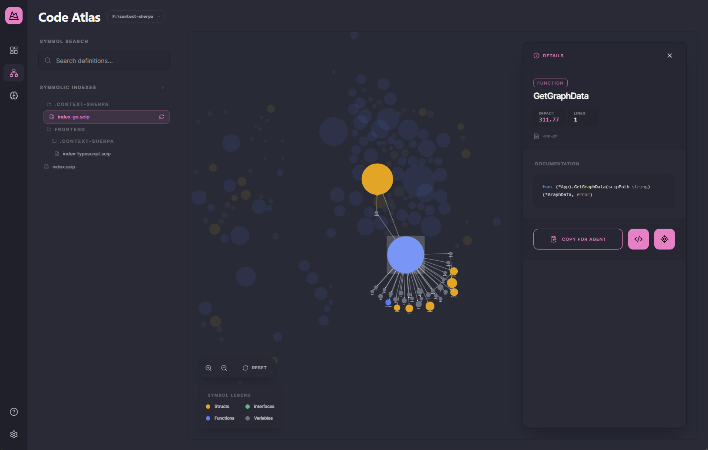
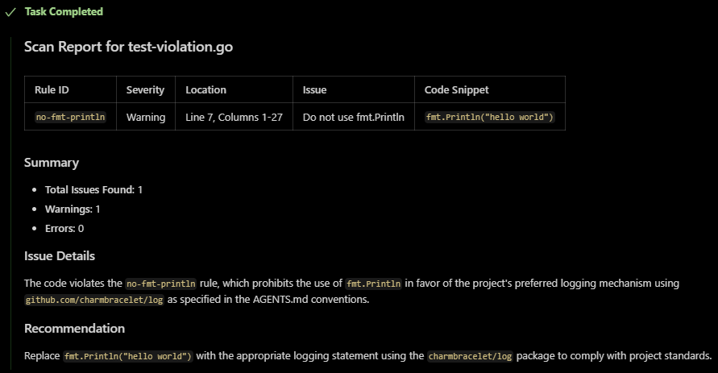

#  Context Sherpa

**Context Sherpa** is a specialized platform for **Context Engineering**. It bridges the gap between developers and AI coding agents by providing LLMs with the precise, high-fidelity signals they need to operate with expert-level accuracy while dramatically reducing token consumption.



## Why Context Engineering?

Agentic coding tools often struggle with either "hallucinating" codebase relationships or overwhelming their context windows with irrelevant files. Context Sherpa solves this through two primary goals:

1.  **Increase Accuracy**: Provide AI agents with strong, symbolic signals (definitions, references, and impact analysis) to ensure code changes are correct and idiomatic.
2.  **Optimize Context**: Using SCIP-based indexing and structural analysis, Context Sherpa allows agents to pinpoint exactly what they need, often reducing the tokens required for a task by up to 90% compared to raw file-searching.

### An Optimized Alternative

Traditional tools like **grep** are fast but lack symbol awareness, while **semantic search** often returns noisy, over-processed results. Context Sherpa's tool suite is designed as a high-fidelity alternative:
- **vs. Grep**: SCIP indexing provides precise symbol-resolution (definitions vs. references), eliminating the guesswork of text-based search.
- **vs. Semantic Search**: Where vectors often fail to distinguish between similar-looking code, our **Structural Analysis** (ast-grep) uses the code's abstract syntax tree for exact pattern matching—**no vector databases or text embeddings required**.
- **vs. Indexing**: Unlike massive, centralized indexing services, Context Sherpa is local-first, lightweight, and requires zero cloud configuration or complex RAG infrastructure.



---

## Core Capabilities

- **Code Atlas Explorer**: A premium GUI to visualize and inspect your codebase relationships.
- **Agent Rule Management**: Dynamically manage project-specific standards using `ast-grep` and natural language feedback.
- **Local Semantic Reasoning**: Tiered inference using local SLMs (SmolLM2, Qwen2.5-Coder) for private, zero-latency code understanding.
- **Universal MCP Server**: A high-performance "headless" mode that integrates directly with tools like Cursor, Cline, and Roo Code.

---

## 🎮 GUI vs. 🖥️ Headless Mode

Context Sherpa is a single executable that adapts to your needs:

| Feature | GUI Mode | Headless (MCP) Mode |
| :--- | :--- | :--- |
| **Code Atlas Explorer** | ✅ Yes | ❌ No |
| **Rule Visualizer/Editor** | ✅ Yes | ❌ API only |
| **Dependency Manager** | ✅ Yes | ❌ Manual |
| **MCP Tool Access** | ✅ Indirectly | ✅ Directly via Agent |
| **Resource Usage** | Standard App | Ultra Lightweight |

---

## ⚡ Quick Start

### Installation

Download the latest version for your platform from [GitHub Releases](https://github.com/hackafterdark/context-sherpa/releases).

- **Windows**: Download the `.exe` and run it.
- **macOS**: Download the app, move to `/Applications`, and clear quarantine if necessary:
  ```bash
  xattr -d com.apple.quarantine /Applications/Context-Sherpa.app
  ```
- **Linux**: Download the binary and provide execution permissions (`chmod +x`).

### Building from Source

Context Sherpa is built with **Go** and **Wails**. For detailed building instructions, please see [BUILDING.md](docs/BUILDING.md).

```bash
# Install Wails
go install github.com/wailsapp/wails/v2/cmd/wails@latest

# Build the GUI
wails build
```

---

## 🛠️ MCP Toolchain

AI agents connected to Context Sherpa gain access to a powerful set of tools for structural, symbolic, and semantic analysis.

For a full list of available tools and their parameters, see [TOOLS.md](docs/TOOLS.md).

### Configuration Example
Add Context Sherpa to your AI agent's `mcp_settings.json`:

```json
{
  "mcpServers": {
    "context-sherpa": {
      "command": "context-sherpa",
      "args": ["--projectRoot", "/path/to/your/project"]
    }
  }
}
```

---

## 📦 Setting Up Dependencies

Context Sherpa uses 3rd party tools to provide high-fidelity intelligence. These can be managed directly in the **GUI Settings** area:

1.  **ast-grep**: The core structural analysis engine.
2.  **SCIP Indexers**: Language-specific indexers for Go, TypeScript, and Python.
3.  **Local SLMs**: Small models for semantic code reasoning (SmolLM2, Qwen2.5-Coder).

---

## 📚 Documentation

- [GUI Guide](docs/GUI_GUIDE.md) - A visual tour of Context Sherpa's premium interface.
- [MCP Tools Reference](docs/TOOLS.md) - Detailed documentation for all 20+ MCP tools.
- [Building Context Sherpa](docs/BUILDING.md) - How to compile the GUI and Headless versions.
- [Contributing Guide](CONTRIBUTING.md) - How to help improve Context Sherpa.

---

## Acknowledgments

Context Sherpa leverages several incredible open-source projects:

- **[ast-grep](https://ast-grep.github.io/)**: The core engine for high-performance structural code analysis.
- **[Wails](https://wails.io/)**: The framework powering our cross-platform desktop experience.
- **[Sourcegraph SCIP](https://github.com/sourcegraph/scip)**: Providing the foundation for precise symbolic code intelligence via `scip-go`, `scip-typescript`, and `scip-python`.
- **Local SLMs**: We are grateful to the creators of **Qwen2.5-Coder-0.5B** and **SmolLM2-135M** for providing the small-but-mighty models that enable our tiered semantic inference.

## License

This project is licensed under the MIT License - see the [LICENSE](LICENSE) file for details.