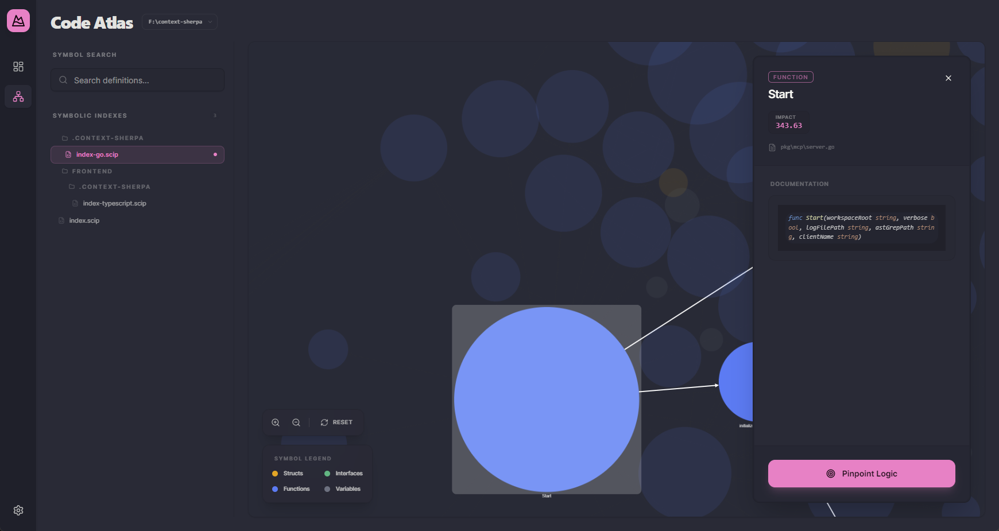
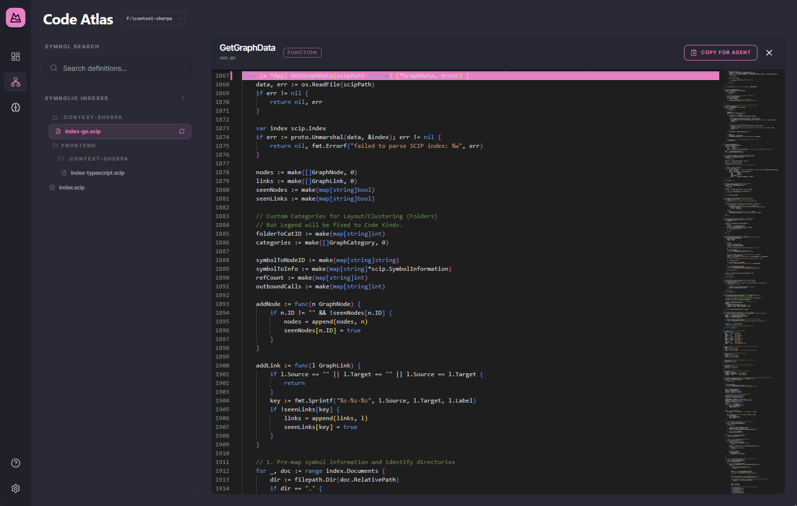
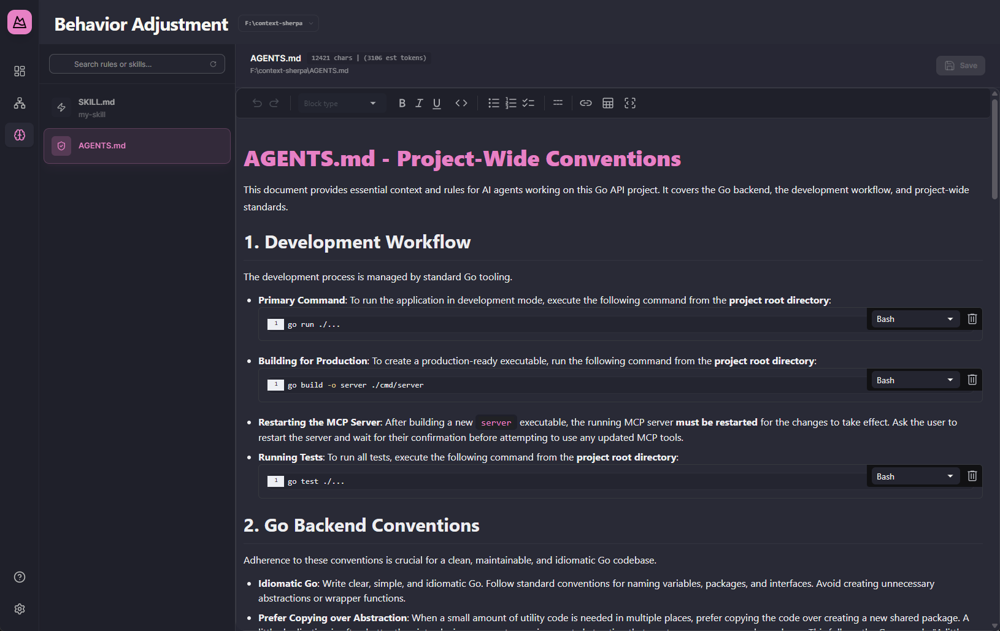
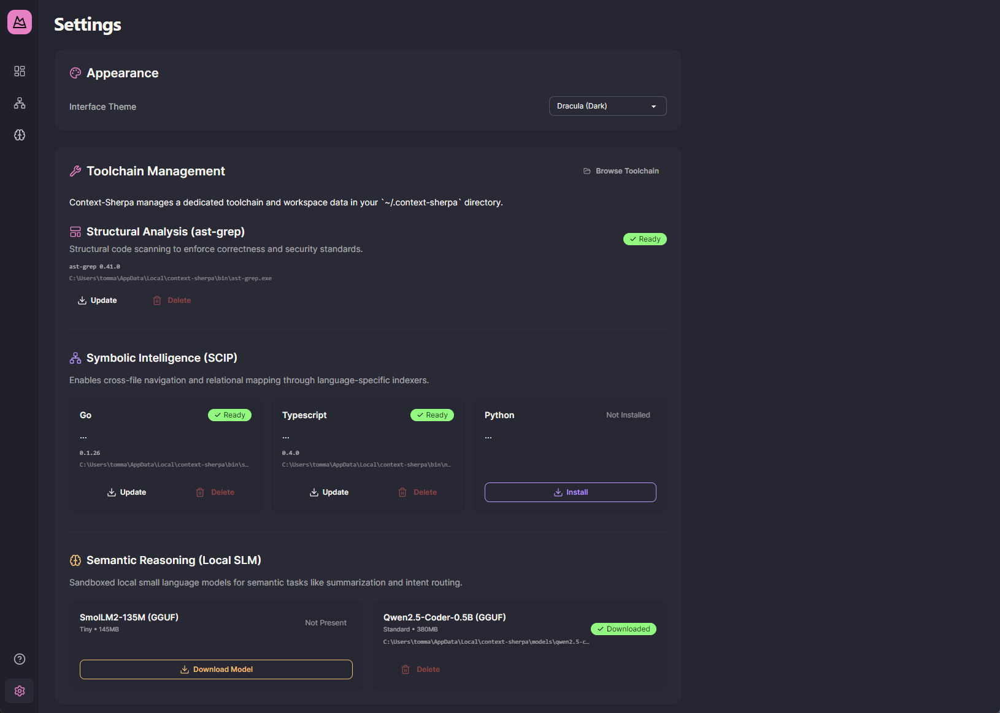

# Context Sherpa GUI Guide

Context Sherpa provides a premium, interactive interface for managing your AI-powered development workflow. This guide explores the key sections of the application.

## 📊 Dashboard & Workspace Management

The Dashboard is your control center for all registered workspaces. Whether you're working on a single project or managing multiple repositories, the dashboard provides a high-level view of your development ecosystem.

## 🗺️ Code Atlas

The Code Atlas is the heart of Context Sherpa's intelligence. It uses SCIP (Symbolic Code Intelligence Protocol) to build a relational graph of your entire codebase.

### Visualizing Relationships
Browse your source code and see exactly how functions, classes, and variables interact across files.



### Deep Code Inspection
Select any node in the graph to view the underlying source code and navigate through symbolic definitions and references.



---

## 🛠️ Behavior Adjustment (Rule Editor)

Context Sherpa allows you to dynamically tune your AI agent's behavior. Use the Behavior Adjustment screen to create and manage `ast-grep` rules using natural language intent.



---

## ⚙️ Settings & Toolchain

The Settings area makes it easy to manage the powerful tools that fuel Context Sherpa's analysis. Install SCIP indexers, manage local SLMs, and configure your preferred theme.



---

## Getting Started with the GUI

To launch the GUI, simply run the `context-sherpa` executable without any headless flags:

```bash
./context-sherpa
```

For more information on building the GUI from source, see [BUILDING.md](BUILDING.md).
